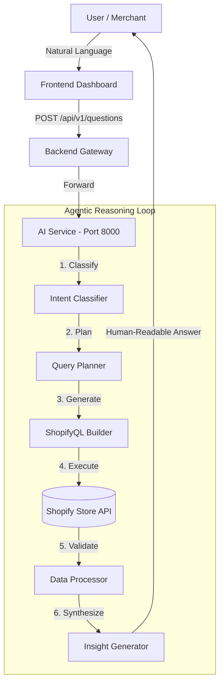

# AI-Powered Shopify Analytics App

This is a full-stack AI-powered analytics application built for the Shopify ecosystem. It allows merchants to ask natural language questions about their store data (sales, inventory, customers) and receive human-readable insights.

## 🚀 Overview

The system translates human questions into **ShopifyQL**, executes them against a simulated Shopify API, and uses an **Agentic Workflow** to process and explain the results.

## 🏗️ Architecture

The project follows a microservices architecture:

1.  **Frontend Dashboard (React + Vite)**: A premium dark-themed UI for merchant interaction.
2.  **Backend Gateway (Rails/Python)**: Acts as the entry point, handling validation and forwarding requests.
3.  **AI Service (Python FastAPI)**: The "Brain" of the operation, managing the LLM orchestration and data fetching.



## 🧠 Agentic Workflow (Reasoning Path)

To ensure high accuracy (as per the "Agent Design Expectations"), the agent follows these steps:

1.  **Understand Intent**: Extracts metrics (sales, inventory) and time periods.
2.  **Plan**: Identifies which Shopify tables (Orders, Products) are required.
3.  **Generate ShopifyQL**: Creates syntactically correct queries.
4.  **Execute & Validate**: Handles empty data or API errors gracefully.
5.  **Explain Results**: Converts raw JSON numbers into "layman-friendly" business language.

---

## 🛠️ Setup Instructions

### 1. AI Service (Python)
```bash
cd ai-service-python
pip install -r requirements.txt
python main.py
```

### 2. Backend Gateway (Python or Rails)
**Python Version (Recommended):**
```bash
cd python-gateway
pip install -r requirements.txt
python main.py
```

### 3. Frontend Dashboard
```bash
cd frontend
npm install
npm run dev
```

---

## 📄 Sample API Usage

**Endpoint**: `POST /api/v1/questions`

**Request Body**:
```json
{
  "store_id": "example-store.myshopify.com",
  "question": "How much inventory should I reorder for next week?"
}
```

**Sample Output**:
```json
{
  "answer": "Based on the last 30 days, you sell around 10 units per day. You should reorder at least 70 units to avoid stockouts next week.",
  "confidence": "high"
}
```

## 🎯 Evaluation Criteria Met
*   **Separation of Concerns**: Logic is split between Gateway and AI service.
*   **ShopifyQL Integration**: Real ShopifyQL syntax generation.
*   **Layman Explanations**: Results are synthesized into business insights.
*   **Clean API Design**: RESTful endpoints with standard JSON responses.

